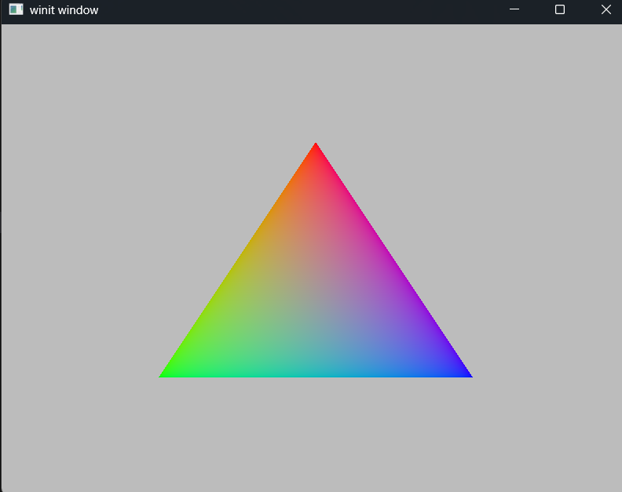

# Exercise 3 - Color Triangle
## Dependencies
- wgpu
- winit
- env_logger
- bytemuck
- pollster
## Objective
Use WGPU and WINIT to generate a multi-colored triangle exploring shaders.
## Output

## Project Notes
- Introduced state.rs to help manage window rendering for the ApplicationHandler.
- Introduced shader.wgsl to start with vertex and fragment shading.
## Code Notes
- Set Background color gray
```rust
// src/state.rs - line 84
let color_attachment_operations = wgpu::Operations {
    load: wgpu::LoadOp::Clear(wgpu::Color{ 
        r: 0.5, 
        g:0.5, 
        b: 0.5, 
        a: 1.0,}), // gray
        store: wgpu::StoreOp::Store,
};
```

- New ```src/shader.wgsl``` 
```glsl
// src/shader.wgsl
struct VOutput{   
    @location(0) v_color: vec4<f32>,
    @builtin(position) position: vec4<f32>,
};

@vertex
fn vs_main(@builtin(vertex_index) in_vertex_index: u32) -> VOutput {    
    var pos = array<vec2<f32>,3>(
        vec2<f32>(0.0, 0.5),
        vec2<f32>(-0.5,-0.5),
        vec2<f32>(0.5,-0.5)
    );
    
    var color = array<vec3<f32>,3>(
        vec3<f32>(1.0, 0.0, 0.0),
        vec3<f32>(0.0, 1.0, 0.0),
        vec3<f32>(0.0, 0.0, 1.0)
    );

    var out: VOutput;
    out.position = vec4<f32>(pos[in_vertex_index], 0.0, 1.0);
    out.v_color = vec4<f32>(color[in_vertex_index], 1.0);
    return out;
}

@fragment
fn fs_main(in: VOutput) -> @location(0) vec4<f32> {
    return in.v_color;
}
```