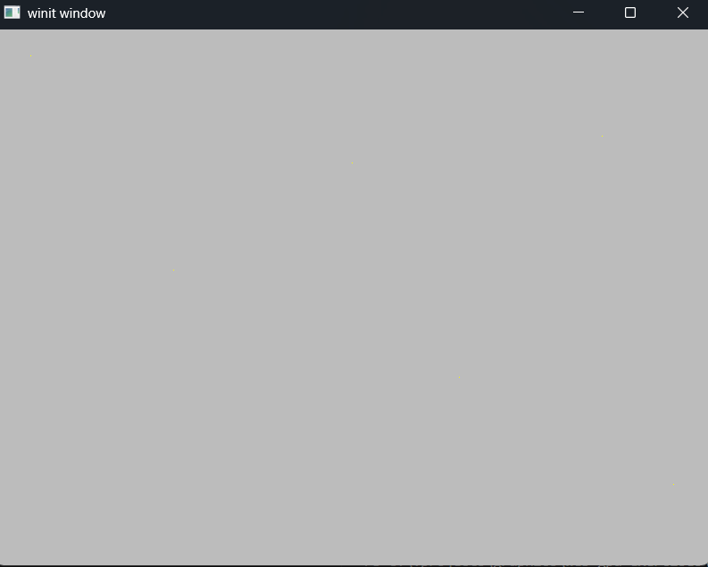
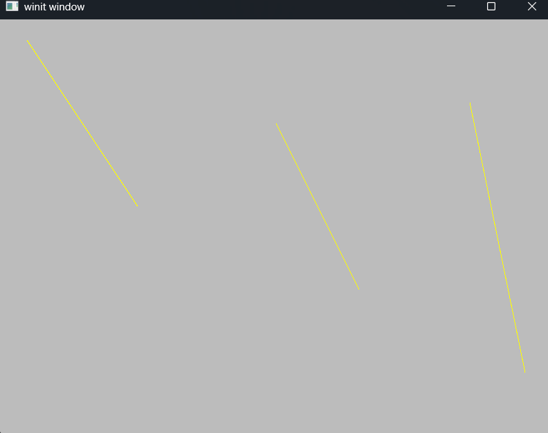

# Exercise 4 - Point/Line List and Strip Primitives
## Dependencies
- wgpu
- winit
- env_logger
- bytemuck
- pollster
## Objective
The objective of this exercise is to explore WGPU Point-Line, Line-Line and Line-Strip functionality, while providing the user the ability to modify the topology via the command line.
## Key Concepts
- WebGPU Point/Line Primitives
  1. Point-List - Collection of points where each point represents a location in space.
  2. Line-List - Collection of vertices connected via a line.
  3. Line-Strip - Connect verticies sequentially to form a single, continuous polyline.
- User Input
- user_input.rs
```rust
use std::env;

#[derive(Default, Debug, Clone, Copy)]
pub enum UserSelection {
    #[default] Help,
    PointList,
    LineList,
    LineStrip,
}

pub fn parse_user_input() -> UserSelection {
    let args: Vec<String> = env::args().collect();

    if args.len() < 2 || args[1] == "help" {
        print_help();
        return UserSelection::Help;
    }

    match args[1].as_str() {
        "point-list" => UserSelection::PointList,
        "line-list" => UserSelection::LineList,
        "line-strip" => UserSelection::LineStrip,
        _ => {
            eprintln!("Unknown mode: '{}'", args[1]);
            print_help();
            UserSelection::Help
        }
    }
}

fn print_help() {
    println!("Usage: cargo run -- <mode>");
    println!("Supported modes:");
    println!("  point-list   - Render using PointList");
    println!("  line-list    - Render using LineList");
    println!("  line-strip   - Render using LineStrip");
    println!("  help         - Show this help message");
}
```
## Output
1. Point-List
- ```cargo run point-list```

  * NOTE: This image isn't super valuable because the points are the size of pixels. They may not be visible depending on the resolution.
2. Line-List
- ```cargo run line-list```

3. Line-Strip
- ```cargo run line-strip```

## Project Notes
- Consolidated app.rs and main.rs into main.rs
## Code Notes
- Adding topology as an attribute to State.
```rust
// src/state.rs - line 6
// Pass user selected Topology into the State
pub struct State {
    window: Arc<Window>,
    device: wgpu::Device,
    queue: wgpu::Queue,
    size: winit::dpi::PhysicalSize<u32>,
    surface: wgpu::Surface<'static>,
    surface_format: wgpu::TextureFormat,
    topology: wgpu::PrimitiveTopology,    // NEW
}
```

- Implementing user-selected topology
```rust
// src/state.rs - line
// Apply user selected topology to the Render Pass Pipeline
let pipeline = self.device.create_render_pipeline(&wgpu::RenderPipelineDescriptor {
  label: None,
  layout: Some(&pipeline_layout),
  vertex: wgpu::VertexState {
    module: &shader,
    entry_point: Some("vs_main"),
    buffers: &[],
    compilation_options: Default::default(),
  },
  fragment: Some(wgpu::FragmentState{ 
    module: &shader,
    entry_point: Some("fs_main"),
    targets: &[Some(wgpu::ColorTargetState {
      format: self.surface_format,
      blend: Some(wgpu::BlendState {
        color: wgpu::BlendComponent::REPLACE,
        alpha: wgpu::BlendComponent::REPLACE,
      }),
      write_mask: wgpu::ColorWrites::ALL,
    })],
    compilation_options: Default::default(),
  }),
  primitive: wgpu::PrimitiveState {
    topology: self.topology,                    // NEW
    ..Default::default()
  },
  depth_stencil: None,
  multisample: wgpu::MultisampleState::default(),
  multiview: None,
  cache: None,
});
```

- Update ```renderpass.draw()``` method for the 6 verticies that are in the shader.wgsl
```rust
// src/state.rs - lina 157
// Update renderpass.draw() to include the 6 verticies.
renderpass.draw(0..6, 0..1);
```

- New ```src/shader.wgsl``` 
```glsl
// src/shader.wgsl
struct VOutput {
    @builtin(position) position: vec4<f32>,
    @location(0) v_color: vec4<f32>,
};

@vertex
fn vs_main(@builtin(vertex_index) in_vertex_index: u32) -> VOutput {
    var pos = array<vec2<f32>, 6>(
        vec2<f32>(-0.9,  0.9),
        vec2<f32>(-0.5,  0.1),
        vec2<f32>( 0.0,  0.5),
        vec2<f32>( 0.3, -0.3),
        vec2<f32>( 0.7,  0.6),
        vec2<f32>( 0.9, -0.7),
    );

    var color = array<vec3<f32>, 6>(
        vec3<f32>(1.0, 0.0, 0.0),
        vec3<f32>(0.0, 1.0, 0.0),
        vec3<f32>(0.0, 0.0, 1.0),
        vec3<f32>(1.0, 1.0, 0.0),
        vec3<f32>(1.0, 0.0, 1.0),
        vec3<f32>(0.0, 1.0, 1.0),
    );

    var out: VOutput;
    out.position = vec4<f32>(pos[in_vertex_index], 0.0, 1.0);
    out.v_color = vec4<f32>(1.0, 1.0, 0.0, 1.0); // yellow
    return out;
}

@fragment
fn fs_main(input: VOutput) -> @location(0) vec4<f32> {
    return input.v_color;
}
```