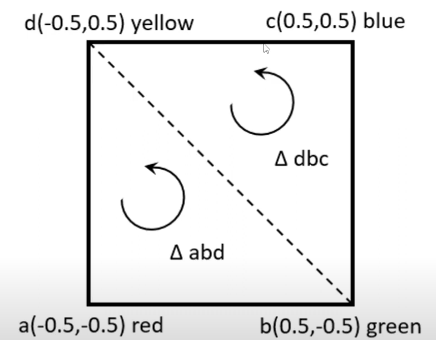
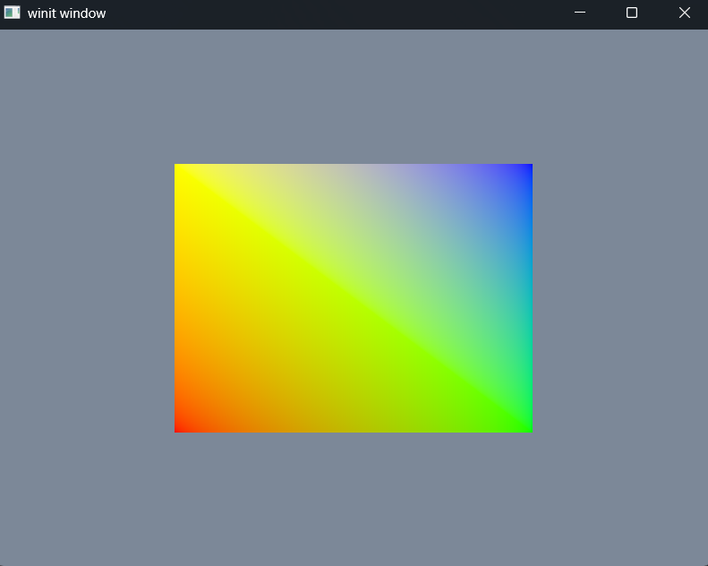

# Exercise 6 - Primitive Square and GPU Buffer
## Dependencies
- wgpu
- winit
- env_logger
- bytemuck
- pollster
## Objective
The objective of this exercise is to explore WGPU Square Primitives and Loading Verticies using GPU Buffers.

The square will have a color pattern that guided by the following image:

## Key Concepts
- GPU Buffer
## Output
- ```cargo run```

## Code Notes
- Added ```vertex.rs``` for maintaining the shader vertex data.
```rust
// src.vertex.rs
#[repr(C)]
#[derive(Copy, Clone, Debug, bytemuck::Pod, bytemuck::Zeroable)]
pub struct Vertex {
    position: [f32; 2],
    color: [f32; 3],
}

// See primitive-square-verticies-blueprint.png Visual
pub const VERTICIES: &[Vertex] = &[
    // First Right Triangle
    Vertex {    // Vertex a
        position: [-0.5, -0.5],
        color: [1.0, 0.0, 0.0],
    },
    Vertex {    // Vertex b
        position: [0.5, -0.5],
        color: [0.0, 1.0, 0.0],
    },
    Vertex {
        position: [-0.5, 0.5],
        color: [1.0, 1.0, 0.0],
    },
    // Second Right Triangle
    Vertex {    // Vertex d
        position: [-0.5, 0.5],
        color: [1.0, 1.0, 0.0],
    },
    Vertex {    // Vertex b
        position: [0.5, -0.5],
        color: [0.0, 1.0, 0.0],
    },
    Vertex {    // Vertex c
        position: [0.5, 0.5],
        color: [0.0, 0.0, 1.0],
    },
];

impl Vertex {
    const ATTRIBUTES: [wgpu::VertexAttribute; 2] = wgpu::vertex_attr_array![0 => Float32x2, 1 => Float32x3];

    pub fn desc<'a>() -> wgpu::VertexBufferLayout<'a> {
        wgpu::VertexBufferLayout {
            array_stride: std::mem::size_of::<Vertex>() as wgpu::BufferAddress,
            step_mode: wgpu::VertexStepMode::Vertex,
            attributes: &Self::ATTRIBUTES,
        }
    }
}
```

- Incorporated buffer into the ```state.rs```
```rust
pub struct State {
    window: Arc<Window>,
    device: wgpu::Device,
    queue: wgpu::Queue,
    size:winit::dpi::PhysicalSize<u32>,
    surface: wgpu::Surface<'static>,
    surface_format: wgpu::TextureFormat,
    vertex_buffer: wgpu::Buffer,            // NEW
}
```

```rust
// src/state.rs - line 29-46 - State::new()
let verticies = VERTICIES;

let vertex_buffer = device.create_buffer_init(&wgpu::util::BufferInitDescriptor {
    label: Some("Vertex Buffer"),
    contents: bytemuck::cast_slice(verticies),
    usage: wgpu::BufferUsages::VERTEX,
});
        
let state = State {
    window,
    device,
    queue,
    size,
    surface,
    surface_format,
    vertex_buffer,                              // NEW
};
```

```rust
// src/state.rs - line 114 - Apply buffers
vertex: wgpu::VertexState {
    module: &shader,
    entry_point: Some("vs_main"),
    buffers: &[Vertex::desc()],                 // NEW
    compilation_options: Default::default(),
}
```

```rust
// src/state.rs - line 142 - Set and draw Vertex Buffers
renderpass.set_vertex_buffer(0, self.vertex_buffer.slice(..));
renderpass.draw(0..VERTICIES.len() as u32, 0..1);  
```

- New ```src/shader.wgsl```
```glsl
// src/shader.wgsl
// NOTE: No Vertex data because its stored in the GPU buffer. See src/vertex.rs >> VERTICIES
struct VertexInput {
    @location(0) pos: vec2<f32>,
    @location(1) color: vec3<f32>,
};

struct VertexOutput {
    @builtin(position) position: vec4<f32>,
    @location(0) color: vec4<f32>,
};

@vertex
fn vs_main(in: VertexInput) -> VertexOutput {
    var out: VertexOutput;
    out.color = vec4<f32>(in.color, 1.0);
    out.position = vec4<f32>(in.pos, 0.0, 1.0);
    return out;
}

@fragment
fn fs_main(in: VertexOutput) -> @location(0) vec4<f32> {
    return in.color;
}
```