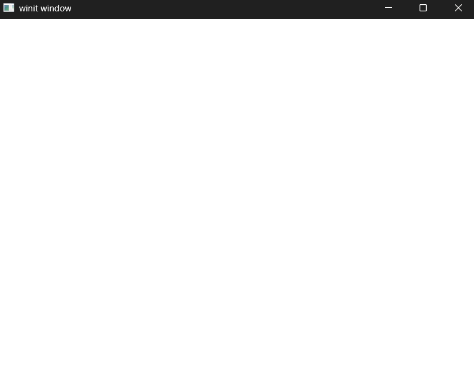

# Exercise 1 - Dependencies and the Window
Here is the code from the [Learn WGPU Repository](https://github.com/sotrh/learn-wgpu/tree/master/code/beginner/tutorial1-window/)
# Dependencies
We will require the following Cargo dependencies:
```toml
[dependencies]
# Allows for error handling
anyhow = "1.0"

# window creation and management library
winit = { version = "0.30", features = ["android-native-activity"] }

# Enable Logging
env_logger = "0.11.8"
log = "0.4"

# WebGPU API Specification implementation
wgpu = "26.0"

# minimal async executor that lets you block a thread until a future completes
pollster = "0.4"                                                        
```
# The Window
We will use our State struct to maintain the window. This is house the WGPU logic, but for now it just houses an reference to the Window and will request a redraw when its render method is invoked.

We will use our App Struct to enable communication between the State and winit. The App will implement the ApplicationHandler, giving us a variety of different functions that we can use to get application events such as key press, mouse movements and various lifecycle events. 

# Demo
Executing a ```cargo build | cargo run``` will run the application rendering a blank window as seen below.
