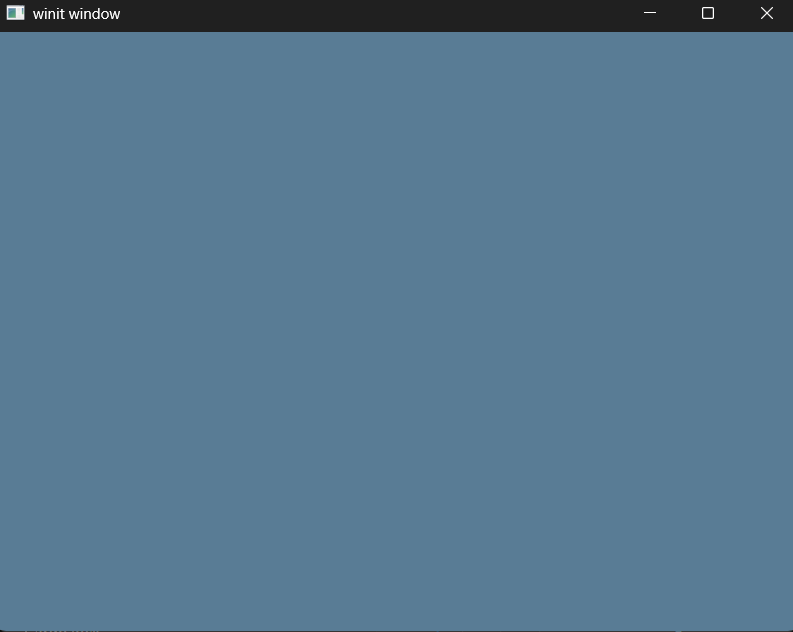

# Exercise 2 = The Surface
Tutorial Link - [Learn WGPU - The Surface](https://sotrh.github.io/learn-wgpu/beginner/tutorial2-surface/)

Tutorial Source Code - [Learn WGPU - Tutorial 2](https://github.com/sotrh/learn-wgpu/tree/master/code/beginner/tutorial2-surface/)

## The Surface
The ```surface``` is the part of the window where we actually draw. In this exercise, we'll see how to create a surface, access its texture to get a view, then attach the view to the render pass for rendering on the window.

Here's the SurfaceConfiguration that will hold the necessary details on how the surface creates its underlying surface textures.

```Rust
let config = wgpu:: SurfaceConfiguration {
    // textures will be used to write to the screen
    usage: wgpu::TextureUsages::RENDER_ATTACHMENT,

    // defines how SurfaceTextures will be stored on the GPU
    format: surface_format,

    // width of the Surface Texture (usually this is the width of the window)
    width: size.width,

    // height of the Surface Texture (usually this is the height of the window)
    height: size.height,

    // uses wgpu::PresentMode enum, which determines how to sync the surface with the display
    present_mode: surface_capabilities.present_modes[0],

    alpha_mode: surface_capabilities.alpha_modes[0],

    // a list of TextureFormats that you can use when creating TextureViews
    view_formats: vec![],

    desired_maximum_frame_latency: 2,
};
```

We will end up using this configuration in the ```State::resize()``` method to reconfigure the surface after every window resize event.
```Rust
pub fn resize(&mut self, width: u32, height: u32) {
        if width > 0 && height > 0 {
            self.config.width = width;
            self.config.height = height;

            // Configure the surface
            self.surface.configure(&self.device, &self.config);
            self.is_surface_configured = true;
        }
    }
```

There are quite a few updates to the ```State::render()``` method to render the surface's texture on the window.
```Rust
pub fn render(&mut self) -> Result<(), SurfaceError> {
    self.window.request_redraw();

    // We can't render if the surface isn't configured.
    if !self.is_surface_configured {
        return Ok(());
    }

    // get the surface to provide a new SurfaceTexture where we will be rendering
    let output = self.surface.get_current_texture()?;

    let texture_view_descriptor = wgpu::TextureViewDescriptor::default();

    let view = output.texture.create_view(&texture_view_descriptor);

    let command_encoder_descriptor = wgpu::CommandEncoderDescriptor {
        label: Some("Render Encoder"),
    };

    // Create command_encoder for generating the actual commands to send to the GPU.
    let mut encoder = self.device.create_command_encoder(&command_encoder_descriptor);

    // The block tells Rust to drop any variables within it when the code leaves that scope, thus releasing the 
    // mutable borrow on encoder and allowing us to finish() it. If you don't like the {}, you can also use drop
    // (render_pass) to achieve the same effect.
    {
        let renderpass_descriptor = wgpu::RenderPassDescriptor {
            label: Some("Render Pass"),
            color_attachments: &[Some(wgpu::RenderPassColorAttachment {
                view: &view,
                resolve_target: None,
                ops: wgpu::Operations {
                    load: wgpu::LoadOp::Clear(wgpu::Color { r: 0.1, g: 0.2, b: 0.3, a: 1.0, }),
                    store: wgpu::StoreOp::Store,
                },
                depth_slice: None,
            })],
            depth_stencil_attachment: None,
            occlusion_query_set: None,
            timestamp_writes: None,
        };

        let _renderpass = encoder.begin_render_pass(&renderpass_descriptor);
    }

    // submit will accept anything that implementsIntoIter
    self.queue.submit(std::iter::once(encoder.finish()));

    output.present();

    Ok(())
}
```

There is a lot of new stuff happening here. First, we are getting the view from the surface's texture. Next we created a Command Encoder, that will be used for generating the commands to run on the GPU. We then embed the view in the ```wgpu::RenderPassDescriptor``` under the color_attachments property.

## Demo
Executing a ```cargo build | cargo run``` will run the application rendering a blueish screen.


Keybindings are the same from the previous exercise.

## Challenge
Modify the input() method to capture mouse events, and update the clear color using that. Hint: you'll probably need to use WindowEvent::CursorMoved.

[EX2 - The Surface - Challenge](../ex2_the_surface_challenge/README.md)