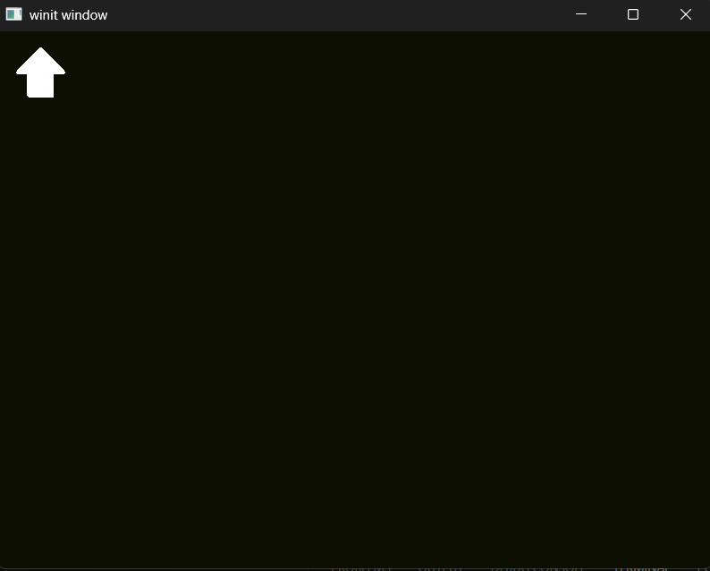
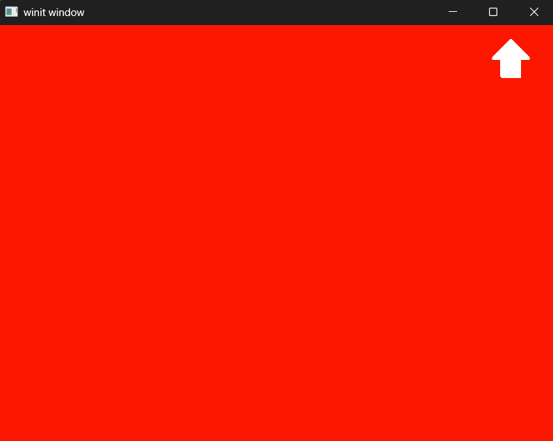
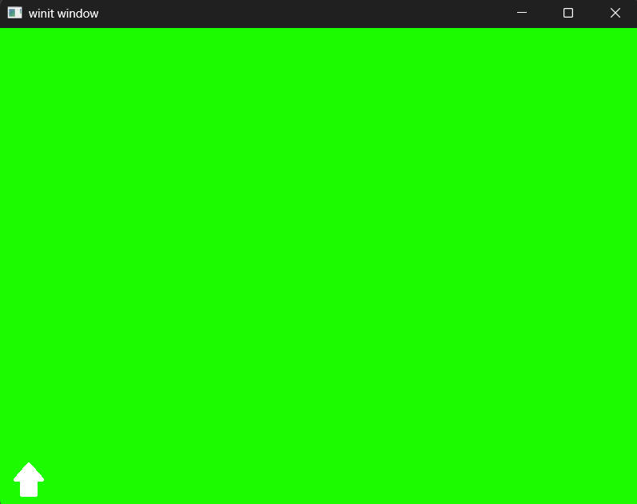
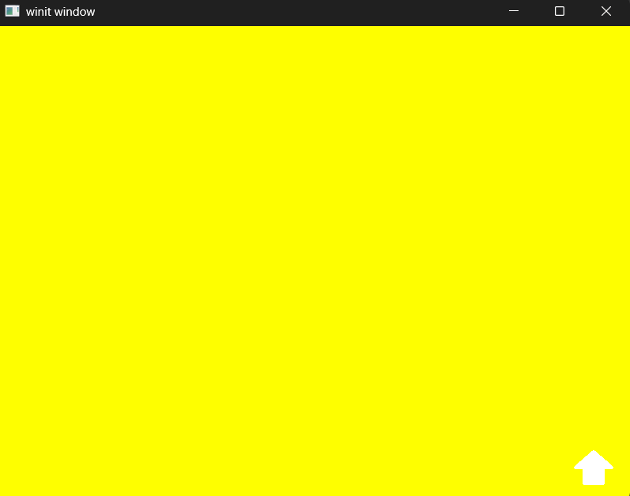

# Objective
Modify the input() method to capture mouse events, and update the clear color using that. Hint: you'll probably need to use WindowEvent::CursorMoved.

# Solution
In order to accomplish this, we need to modify the state to:
  1. Store the mouse-adjustable color
  2. Provide an interface to modify the color

First we'll update the State struct to house the new variable:
```Rust
pub struct State {
    pub window: Arc<Window>,
    surface: wgpu::Surface<'static>,
    device: wgpu::Device,
    queue: wgpu::Queue,
    config: wgpu::SurfaceConfiguration,
    is_surface_configured: bool,

    // Storing the mouse-adjustable color
    mouse_adjustable_color: wgpu::Color,
}
```
Don't forget to set it in the ```new()``` method:
```Rust
Ok(Self {
    window,
    surface,
    device,
    queue,
    config,
    is_surface_configured: false,

    // Set that color's default to Black
    mouse_adjustable_color: wgpu::Color::BLACK,
})
```
We need to set this in our RenderPass under the ```color_attachments``` attribute:
```Rust
let _renderpass = encoder.begin_render_pass(&wgpu::RenderPassDescriptor {
    label: Some("Render Pass"),
    color_attachments: &[Some(wgpu::RenderPassColorAttachment {
        view: &view,
        resolve_target: None,
            ops: wgpu::Operations {
            // Set the mouse-adjustable color instead of the blue-gray preset
            load: wgpu::LoadOp::Clear(self.mouse_adjustable_color),
            store: wgpu::StoreOp::Store,
        },
        depth_slice: None,
    })],
    depth_stencil_attachment: None,
    occlusion_query_set: None,
    timestamp_writes: None,
});
```

And then the interface to modify the color will be based on the (X, Y) position of the cursor (X corresponds to Red and Y corresponds to Green).
```Rust
pub fn handle_mouse_move(&mut self, x: f64, y: f64) {
    self.mouse_adjustable_color.r = x / self.config.width as f64;
    self.mouse_adjustable_color.g = y / self.config.height as f64;
}
```

Finally, we need an event to pass to the state to modify the color. We'll go to the App implementation for the window_event method. We'll add the following event to gather the cursor position and send it to the state handle_mouse_move method:
```Rust
// Pass the cursor position to the State's handle_mouse_move method.
WindowEvent::CursorMoved { position, .. } => {
    state.handle_mouse_move(position.x, position.y);
},
```

# Demo
Executing a ```cargo build | cargo run``` will run the application.

As you move the cursor around the screen you should see it fade between colors depending on how you have the hande_mouse_move computation. Play around with it and see what else you can come up with.

### Cursor Top-Left


### Cursor Top-Right


### Cursor Bottom-Left


### Cursor Bottom-Right
