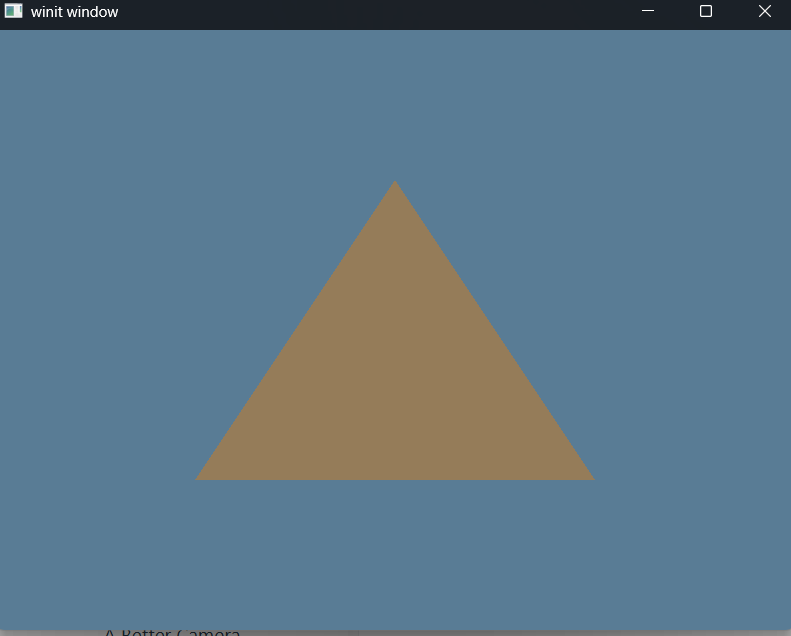

# Exercise 3 - The Pipeline
Tutorial Link - [Learn WGPU - The Pipeline](https://sotrh.github.io/learn-wgpu/beginner/tutorial3-pipeline)

Tutorial Source Code - [Learn WGPU - Tutorial 3](https://github.com/sotrh/learn-wgpu/tree/master/code/beginner/tutorial3-pipeline/)

## The Pipeline
A pipeline describes actions the GPU will perform when acting on a data set. We will be using the ```RenderPipeline``` for our purposes.

## Shaders
Shaders are mini-programs that you send to the GPU to perform operaitons on your data.

Types of Shaders
  1. Vertex
  2. Fragment
  3. Compute
  4. Geometry       (Not supported by WebGPU)
  5. Tesselation    (Not supported by WebGPU)

### Vertex
A vertex is a point in 2D/3D Space. These vertices are then bundled in pairs to form lines and/or triples to form triangles. 

Most modern rendering uses triangles to make all shapes as the basis. We use the vertex shader to manipulate these vertices to transform the shape to render how we expect.

### Fragment
The vertices are then converted into fragments. Every pixel result image gets at least one fragment. Each fragment has a color that will be copied to its corresponding pixel.

The fragment shader decides what color the fragment will be.

### WGSL
[WebGPU Shading Language (WGSL)](https://www.w3.org/TR/WGSL/)

Here is the ```shader.wgsl```, that we will pass to the Render Pipeline:

```glsl
// struct to store the output of our vertex shader.
struct VertexOutput {
    // @builtin(position) bit tells WGPU that this is the value we want to use as the vertex's clip coordinates
    @builtin(position) clip_position: vec4<f32>,

    // Vertical position coordinates passed for the vertex.
    @location(0) vert_pos: vec3<f32>,
};

// @vertex marks that this function as a valid entry point for a vertex shader
@vertex
fn vs_main(
    //  We expect a u32 called in_vertex_index, which gets its value from @builtin(vertex_index).
    @builtin(vertex_index) in_vertex_index: u32,
) -> VertexOutput {
    var out: VertexOutput;

    let x = f32(1 - i32(in_vertex_index)) * 0.5;
    
    let y = f32(i32(in_vertex_index & 1u) * 2 - 1) * 0.5;

    out.clip_position = vec4<f32>(x, y, 0.0, 1.0);

    return out;
}

// @fragment marks that this function as a valid entry point for a fragment shader
@fragment
fn fs_main(
    in: VertexOutput
) -> @location(0) vec4<f32> {   // The @location(0) bit tells WGPU to store the vec4 value returned by this function in the first color target
    return vec4<f32>(0.3, 0.2, 0.1, 1.0);
}
```

## Rendering Shaders
To apply the shaders to the surface we have to create a ```wgpu::RenderPipelineLayout``` to attach our vertex and fragment shaders to the window output.

```Rust
// This will load the Vertex and Fragment shaders in the shader.wgsl file.
let shader = device.create_shader_module(wgpu::include_wgsl!("shader.wgsl"));

// Now that we have the shaders loaded, we need to incorporate them into a Pipeline Layout to be loaded into the Render Pipeline
let render_pipeline_layout = device.create_pipeline_layout(&wgpu::PipelineLayoutDescriptor {
    label: Some("Render Pipeline Layout"),
    bind_group_layouts: &[],
    push_constant_ranges: &[],
});

// Create the Render Pipeline
let render_pipeline = device.create_render_pipeline(&wgpu::RenderPipelineDescriptor {
    label: Some("Render Pipeline"),

    // Attach the Render Pipeline Layout to this Render Pipeline
    layout: Some(&render_pipeline_layout),

    // Used for storing the vertices to the surface
    vertex: wgpu::VertexState {

        // Attach the loaded shader to the Vertex State.
        module: &shader,

        // Shader Vertex entry point (function)
        // @vertex decorated function in shader.wgsl
        entry_point: Some("vs_main"),

        // tells wgpu what type of vertices we want to pass to the vertex shader 
        // we're specifying the vertices in the vertex shader itself, so we'll leave this empty.
        buffers: &[],

        compilation_options: wgpu::PipelineCompilationOptions::default(),
    },

    // Used for storing the colors to the surface
    fragment: Some(wgpu::FragmentState {

        // Attach the loaded shader to the Fragment State.
        module: &shader,

        // Shader Fragment entry point
        // @fragment decorated function in shader.wgsl
        entry_point: Some("fs_main"),

        // tells wgpu what color outputs it should set up. Currently, we only need one for the surface. 
        targets: &[Some(wgpu::ColorTargetState {
            // use the surface's format
            format: config.format,

            // specify that blending should replace old pixel data
            blend: Some(wgpu::BlendState::REPLACE),

            // tells wgpu to write all colors (red, blue, green, alpha).
            write_mask: wgpu::ColorWrites::ALL,
        })],

        compilation_options: wgpu::PipelineCompilationOptions::default(),
    }),
            
    // tells the wgpu how to interpret our vertices when converting them in to the desired topology
    primitive: wgpu::PrimitiveState {

        // means that every 3 vertices will correspond to 1 triangle
        topology: wgpu::PrimitiveTopology::TriangleList,
                
        strip_index_format: None,

        // FrontFace::Ccw means that a triangle is facing forward if the vertices are arrange in a counter-clockwise direction
        front_face: wgpu::FrontFace::Ccw,

        // triangles that are not considered facing forward are culled (not included in the render) as specified by CullMode::Back
        cull_mode: Some(wgpu::Face::Back),

        // Setting this to anything other than Fill requires Features::NON_FILL_POLYGON_MODE
        polygon_mode: wgpu::PolygonMode::Fill,

        // Requires Features::DEPTH_CLIP_CONTROL
        unclipped_depth: false,

        // allows wgpu to cache shader compilation data. Only really useful for Android build targets.
        // Requires Features::CONSERVATIVE_RASTERIZATION
        conservative: false,
    },
    depth_stencil: None,
    multisample: wgpu::MultisampleState {
        // determines how many samples the pipeline will use
        count: 1,

        // specifies which samples should be active. In this case, we are using all of them.
        mask: !0,

            // has to do with anti-aliasing
        alpha_to_coverage_enabled: false,
    },

    // indicates how many array layers the render attachments can have
    multiview: None,

    // allows wgpu to cache shader compilation data
    cache: None,
});
```

After creating the layout for the surface and attaching it to the layout, we have to instruct the render pipeline on how to draw it.

```Rust
// Attach the render pipeline to the RenderPass
renderpass.set_pipeline(&self.render_pipeline);

// Tell wgpu to draw
renderpass.draw(
    0..3,           // This is 3 vertices (the 3 in the shader.wgsl)
    0..1            // this means to crate only 1 instance (This is where @builtin(vertex_index) comes from)
);
```
## Demo
Executing a ```cargo build | cargo run``` will run the application rendering a blueish screen with a brown triangle in the center.


Keybindings are the same from the previous exercise.

## Challenge
Create a second pipeline that uses the triangle's position data to create a color that it then sends to the fragment shader. Have the app swap between these when you press the spacebar. Hint: you'll need to modify VertexOutput

[EX3 - The Pipeline - Challenge](../ex3_the_pipeline_challenge/README.md)