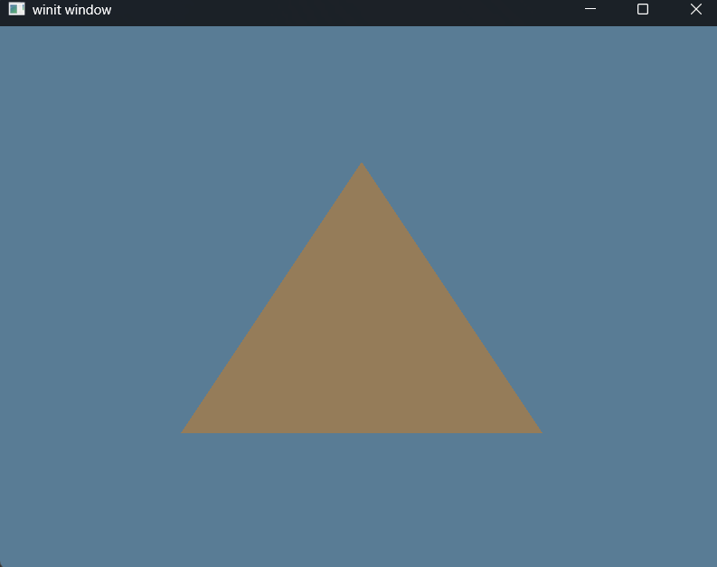
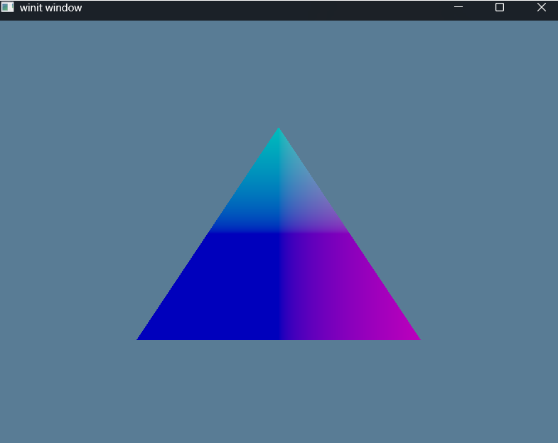

# Exercise 3 - The Pipeline - Challenge
## Objective
Create a second pipeline that uses the triangle's position data to create a color that it then sends to the fragment shader. Have the app swap between these when you press the spacebar. Hint: you'll need to modify VertexOutput

# Solution
Tutorial Source Code - [Learn WGPU - Tutorial 3 Challenge](https://github.com/sotrh/learn-wgpu/blob/master/code/beginner/tutorial3-pipeline/src/challenge.rs)

In order to accomplish this, we needed make a few modifications:
  - State
    1. Add property to track whether or not to use the ```shader_challenge.wgsl``` or the original ```shader.wgsl```
    2. Create separate RenderPipeline that implements the challenge shader properties
    3. Update the render logic to swap between the 2 shaders
    4. Add extra match crieria for the SPACE BAR key press.

Here's the separate ```shader_challenge.wgsl``` with the different color option:
```glsl
struct VertexOutput {
    @builtin(position) clip_position: vec4<f32>,
    @location(0) position: vec2<f32>,
};

@vertex
fn vs_main(@builtin(vertex_index) in_vertex_index: u32) -> VertexOutput {
    var out: VertexOutput;

    let x = f32(1 - i32(in_vertex_index)) * 0.5;
    let y = f32(i32(in_vertex_index & 1u) * 2 - 1) * 0.5;

    out.position = vec2<f32>(x, y);
    out.clip_position = vec4<f32>(x, y, 0.0, 1.0);

    return out;
}

@fragment
fn fs_main(in: VertexOutput) -> @location(0) vec4<f32> {
    // Uses different color in the fragment as the original render-pipeline
    return vec4<f32>(in.position, 0.5, 1.0);
}
```

Now we'll update the State with a couple properties to help us make this swap:

```Rust
pub struct State {
    pub window: Arc<Window>,
    surface: wgpu::Surface<'static>,
    device: wgpu::Device,
    queue: wgpu::Queue,
    config: wgpu::SurfaceConfiguration,
    is_surface_configured: bool,
    render_pipeline: wgpu::RenderPipeline,

    // Properties added for challenge
    use_color: bool,
    challenge_render_pipeline: wgpu::RenderPipeline,
}
```

And in the ```State::new()``` method, we'll import the challenge shader and create the separate pipeline.
```Rust
// Load different shader for the challenge problem
let challenge_shader = device.create_shader_module(wgpu::include_wgsl!("shader_challenge.wgsl"));

// Create similar pipeline with the challenge shader loaded
let challenge_render_pipeline = device.create_render_pipeline(&wgpu::RenderPipelineDescriptor {
    label: Some("Render Pipeline Challenge"),

    // reuse the layout
    layout: Some(&render_pipeline_layout),

    vertex: wgpu::VertexState {
        module: &challenge_shader,
        entry_point: Some("vs_main"),
        buffers: &[],
        compilation_options: wgpu::PipelineCompilationOptions::default(),
    },
    fragment: Some(wgpu::FragmentState {
        module: &challenge_shader,
        entry_point: Some("fs_main"),
        targets: &[Some(wgpu::ColorTargetState {
            format: config.format,
            blend: Some(wgpu::BlendState::REPLACE),
            write_mask: wgpu::ColorWrites::ALL,
        })],
        compilation_options: wgpu::PipelineCompilationOptions::default(),
    }),
    primitive: wgpu::PrimitiveState {
        topology: wgpu::PrimitiveTopology::TriangleList,
        strip_index_format: None,
        front_face: wgpu::FrontFace::Ccw,
        cull_mode: Some(wgpu::Face::Back),
        polygon_mode: wgpu::PolygonMode::Fill,
        ..Default::default()
    },
    depth_stencil: None,
    multisample: wgpu::MultisampleState {
        count: 1,
        mask: !0,
        alpha_to_coverage_enabled: false,
    },
    multiview: None,
    cache: None,
});

Ok(Self {
    window,
    surface,
    device,
    queue,
    config,
    is_surface_configured: false,
    render_pipeline,

    // maintained in state because the status will change depending on user input.
    use_color: true,
    // maintained the challenge render pipeline for swapping when the SPACE Bar is pressed.
    challenge_render_pipeline,
})
```

And in our ```State::render()``` method, we'll add the swapping logic to check if we should use the challenge shaders or the original ones:
```Rust
// If the SPACE BAR is pressed, then use the challenge render pipeline, otherwise use the old one.
let renderpass_pipeline = if self.use_color {
    &self.render_pipeline
} else {
    &self.challenge_render_pipeline
};

renderpass.set_pipeline(renderpass_pipeline);
```

And we can't forget to actually handle the space bar press. We'll update the ```State::handle_key()``` method:
```Rust
pub fn handle_key(&mut self, event_loop: &ActiveEventLoop, code: KeyCode, is_pressed: bool) {
    match (code, is_pressed) {
        (KeyCode::Escape, true) => {
            event_loop.exit();
        },
        // Add new handle for SPACE BAR press to toggle the color
        (KeyCode::Space, is_pressed) => {
            // Toggle the use_color status when the SPACE BAR is pressed.
            self.use_color = !is_pressed;
        }
        _ => {}
    }
}
```

# Demo
Executing a ```cargo build | cargo run``` will run the application.

Pressing and releasing the space bar will trigger the render pipeline to swap between the shaders.

### Space Bar Released


### Space Bar Pressed
