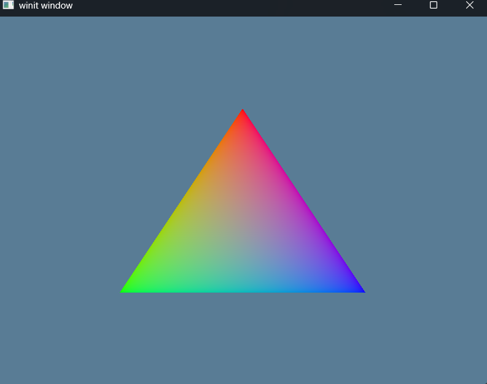

# Exercise 4a - Vertex Buffers
Tutorial Link - [Learn WGPU - Buffers and Indices - The vertex buffer](https://sotrh.github.io/learn-wgpu/beginner/tutorial4-buffer/#the-vertex-buffer)

Tutorial Source Code - [Learn WGPU - Tutorial 4](https://github.com/sotrh/learn-wgpu/tree/master/code/beginner/tutorial4-buffer/)

## Vertex Buffer
In the previous exercise we stored the vertex data in the ```shader.wgsl```. This is not ideal because recompiling the shader whenever we need to update the model would be a massive performance hit. We use the <strong>Vertex Buffers</strong> to store the vertex data we want to draw.

We'll define a ```struct``` that represents the vertex data we want to draw:

```Rust
#[repr(C)]
#[derive(Copy, Clone, Debug)]
struct Vertex {
    position: [f32; 3],
    color: [f32; 3],
}
```

The position represents the x, y, and z in 3d space and the color is red, green, blue values of the vertex.

We created the actual verticies data:

```Rust
pub const VERTICES: &[Vertex] = &[
    Vertex { 
        position: [ 0.0,  0.5, 0.0], 
        color: [1.0, 0.0, 0.0],
    },
    Vertex { 
        position: [-0.5, -0.5, 0.0], 
        color: [0.0, 1.0, 0.0],
    },
    Vertex { 
        position: [ 0.5, -0.5, 0.0], 
        color: [0.0, 0.0, 1.0], 
    },
];
```

The vertices are arranged in counter-clockwise order: top, bottom, left, bottom, right. This is done because we specified the primitive of the ```render_pipeline``` that we want the front_face of our triangle to be ```wgpu::FrontFace::Ccw``` so that we cull the back face. This means that any triangle that should be facing use should have its verticies in counter-clockwise order.

Now that we have some vertex data its time to create the buffer.

We'll update the state to maintain the vertex buffer because we use it for the layout initialization and we add this to the render pass pipeline during rendering. We also added a property ```num_verticies``` that will be used to dynamically set the vertex range during the ```renderpass.draw()``` method. 

```Rust
pub struct State {
    pub window: Arc<Window>,
    surface: wgpu::Surface<'static>,
    device: wgpu::Device,
    queue: wgpu::Queue,
    config: wgpu::SurfaceConfiguration,
    is_surface_configured: bool,
    render_pipeline: wgpu::RenderPipeline,

    // store vertex buffer because it is used during the rendering
    vertex_buffer: wgpu::Buffer,
    // store the number of vertices because it is used during the rendering
    num_vertices: u32,
}
```

To create the buffer we need access to the ```create_buffer_init()``` method on the ```wgpu::Device``` via the ```DeviceExt``` extension trait. For more information see [```wgpu::util::DeviceExt::create_buffer_init```](https://docs.rs/wgpu/latest/wgpu/util/trait.DeviceExt.html#tymethod.create_buffer_init).
```Rust
use wgpu::util:DeviceExt;
```

We will also need to update our dependencies to include ```bytemuck```. 
```toml
[dependencies]
anyhow = "1.0.99"
winit = "0.30"
env_logger = "0.11"
log = "0.4"
wgpu = "26"
pollster = "0.4"
bytemuck = "1.23"
```

We are going to use this library for:
  1. casting our ```VERTICES``` as ```&[u8]``` from its base ```&[Vertex]```, and
  2. its ```bytemuck::Pod``` and ```bytemuck::Zeroable``` traits that we need to attach to the ```struct Vertex``` for the casting.
    a. ```bytemuck::Pod``` - Indicates that our Vertex is "Plain Old Data", and can be interpreted as ```&[u8]```
    b. ```bytemuck::Zeroable``` - indicates that we can use ```std::mem::zeroed()```

Before performing our cast, we need to implement our traits:
```Rust
#[repr(C)]
#[derive(
    // the Vertex to be Copy so we can create a buffer with it
    Copy,

    Clone,
    
    Debug,

    // Pod indicates that our Vertex is "Plain Old Data", and thus can be interpreted as a &[u8]
    bytemuck::Pod,

    // Zeroable indicates that we can use std::mem::zeroed()
    bytemuck::Zeroable  
)]
pub struct Vertex {
    // represents the x, y, and z of the vertex in 3d space
    position: [f32; 3],

    // represents the red, green, and blue values for the vertex
    color: [f32; 3],
}
```

Inside the ```State.new()``` we'll create the buffer.
```Rust
// create the vertex buffer
let vertex_buffer = device.create_buffer_init(&wgpu::util::BufferInitDescriptor {
    label: Some("Vertex Buffer"),

    // store the buffer stored in VERTICES
    // using bytemuck (opens new window)to cast our VERTICES as a &[u8]
    contents: bytemuck::cast_slice(VERTICES),

    // indicates that this buffer is a vertex buffer
    usage: wgpu::BufferUsages::VERTEX,
});
```

Now that we have this vertex buffer (don't forget to add the buffer and number of vertices at the end of ```new()```), we need to let the Render Pipeline know how to read it. In order to do this we'll need the ```Vertex``` to provide a ```wgpu::VertexBufferLayout``` that will define how the buffer is represented in memory. We'll update the ```Vertex``` struct to implement ```pub fn desc() -> wgpu::VertexBufferLayout<'static>``` and return the necessary layout for our task.

```Rust
impl Vertex {
    pub fn desc() -> wgpu::VertexBufferLayout<'static> {
        wgpu::VertexBufferLayout {
            // defines how wide a vertex is
            // when the shader goes to read the next vertex, it will skip over the array_stride number of bytes
            array_stride: std::mem::size_of::<Vertex>() as wgpu::BufferAddress,

            // tells the pipeline whether each element of the array in this buffer represents per-vertex data or per-instance data
            step_mode: wgpu::VertexStepMode::Vertex,

            // describes the individual parts of the vertex
            attributes: &[

                wgpu::VertexAttribute {
                    // defines the offset in bytes until the attribute starts
                    // For the first attribute, the offset is usually zero. For any later attributes, the offset is the sum over size_of of the previous attributes' data.
                    offset: 0,

                    // tells the shader what location to store this attribute at
                    // For example, @location(0) x: vec3<f32> in the vertex shader would correspond to the position field of the Vertex struct, while @location(1) x: vec3<f32> would be the color field
                    shader_location: 0,

                    // tells the shader the shape of the attribute
                    // Float32x3 corresponds to vec3<f32> in shader code
                    format: wgpu::VertexFormat::Float32x3,
                },

                wgpu::VertexAttribute {
                    // defines the offset in bytes until the attribute starts
                    // For the first attribute, the offset is usually zero. For any later attributes, the offset is the sum over size_of of the previous attributes' data.
                    offset: std::mem::size_of::<[f32; 3]>() as wgpu::BufferAddress,

                    // tells the shader what location to store this attribute at
                    // For example, @location(0) x: vec3<f32> in the vertex shader would correspond to the position field of the Vertex struct, while @location(1) x: vec3<f32> would be the color field
                    shader_location: 1,

                    // tells the shader the shape of the attribute
                    // Float32x3 corresponds to vec3<f32> in shader code
                    format: wgpu::VertexFormat::Float32x3,
                },
            ] 
        }
    }
}
```

Now that we have a method for getting the <strong>Vertex Buffer Layout</strong> we need to add this to the Render Pipeline.
```Rust
let render_pipeline = device.create_render_pipeline(&wgpu::RenderPipelineDescriptor {
            label: Some("Render Pipeline"),
            layout: Some(&render_pipeline_layout),
            vertex: wgpu::VertexState {
                module: &shader,
                entry_point: Some("vs_main"),
                buffers: &[

                    // Add the Buffer to the Render Pipeline Vertex State
                    Vertex::desc(),

                ],
                compilation_options: wgpu::PipelineCompilationOptions::default(),
            },
            fragment: Some(wgpu::FragmentState {
               module: &shader,
               entry_point: Some("fs_main"),
               targets: &[Some(wgpu::ColorTargetState {
                format: config.format,
                blend: Some(wgpu::BlendState::REPLACE),
                write_mask: wgpu::ColorWrites::ALL,
               })],
               compilation_options: wgpu::PipelineCompilationOptions::default(),
            }),
            primitive: wgpu::PrimitiveState {
                topology: wgpu::PrimitiveTopology::TriangleList,
                strip_index_format: None,
                front_face: wgpu::FrontFace::Ccw,
                cull_mode: Some(wgpu::Face::Back),
                polygon_mode: wgpu::PolygonMode::Fill,
                unclipped_depth: false,
                conservative: false,
            },
            depth_stencil: None,
            multisample: wgpu::MultisampleState {
                count: 1,
                mask: !0,
                alpha_to_coverage_enabled: false,
            },
            multiview: None,
            cache: None,
        });
```

And now that the pipeline is setup with our Vertex Buffer, we need to update our draw commands to render this correctly:
```Rust
renderpass.set_pipeline(&self.render_pipeline);

// set the vertex buffer for the renderpass
renderpass.set_vertex_buffer(
    // what buffer slot to use for this vertex buffer (You can have multiple vertex buffers set at a time)
    0,
                
    // is the slice of the buffer to use (We use .. to specify the entire buffer)
    self.vertex_buffer.slice(..)    
);

renderpass.draw(
    // use the vertex buffer in a draw call
    0..self.num_vertices,

    // create one instance                   
    0..1
);
```

And the final step is to update our ```shader.wgsl``` so that it will know to get the data from the vertex buffer.
```glsl
struct VertexInput {
    @location(0) position: vec3<f32>,
    @location(1) color: vec3<f32>,
};

struct VertexOutput {
    @builtin(position) clip_position: vec4<f32>,
    @location(0) color: vec3<f32>,
};

@vertex
fn vs_main(
    model: VertexInput
) -> VertexOutput {
    var out: VertexOutput;

    out.color = model.color;
    out.clip_position = vec4<f32>(model.position, 1.0);

    return out;
}

@fragment
fn fs_main(
    in: VertexOutput
) -> @location(0) vec4<f32> {
    return vec4<f32>(in.color, 1.0);
}
```

## Demo
Executing a ```cargo build | cargo run``` will run the application rendering a blueish screen with a brown triangle in the center.


Keybindings are the same from the previous exercise.

## Next Steps
Now that we setup our vertex buffers, its time to discuss index buffers.

[EX4b - Index Buffers](../ex4b_index_buffers/README.md)