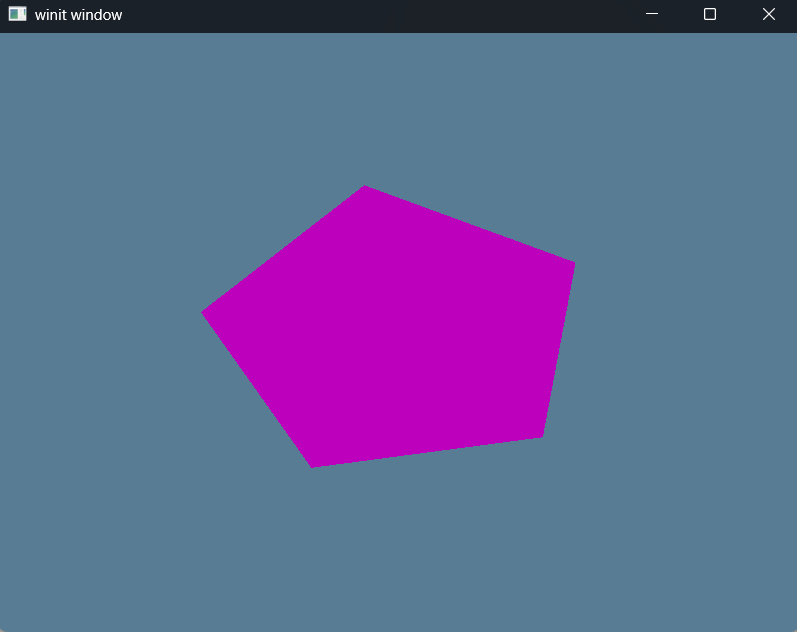

# Exercise 4a - Vertex Buffers
Tutorial Link - [Learn WGPU - Buffers and Indices - The index buffer](https://sotrh.github.io/learn-wgpu/beginner/tutorial4-buffer/#the-index-buffer)

Tutorial Source Code - [Learn WGPU - Tutorial 4](https://github.com/sotrh/learn-wgpu/tree/master/code/beginner/tutorial4-buffer/)

## Index Buffer
Index buffers come into play when we start using models with a lot of triangles. Let's consider this pentagon from the tutorial that we'll render in this task.

[alt text](.assets/polygon_layout.png "Polygon Layout")

This polygon has
  - 5 vertices, and
  - 3 triangles

If we wanted to represent this shape using vertices alone, then we'd end up with something like this for our pentagon:
```Rust
const VERTICES: &[Vertex] = &[
    Vertex { position: [-0.0868241, 0.49240386, 0.0], color: [0.5, 0.0, 0.5] }, // A
    Vertex { position: [-0.49513406, 0.06958647, 0.0], color: [0.5, 0.0, 0.5] }, // B
    Vertex { position: [0.44147372, 0.2347359, 0.0], color: [0.5, 0.0, 0.5] }, // E

    Vertex { position: [-0.49513406, 0.06958647, 0.0], color: [0.5, 0.0, 0.5] }, // B
    Vertex { position: [-0.21918549, -0.44939706, 0.0], color: [0.5, 0.0, 0.5] }, // C
    Vertex { position: [0.44147372, 0.2347359, 0.0], color: [0.5, 0.0, 0.5] }, // E

    Vertex { position: [-0.21918549, -0.44939706, 0.0], color: [0.5, 0.0, 0.5] }, // C
    Vertex { position: [0.35966998, -0.3473291, 0.0], color: [0.5, 0.0, 0.5] }, // D
    Vertex { position: [0.44147372, 0.2347359, 0.0], color: [0.5, 0.0, 0.5] }, // E
];
```

If you notice, there are some duplicate Vertices added to accommodate for the triangles that have adjacent edges. In our case, <strong>Vertex C</strong> and <strong>Vertex B</strong> are repeated twice, and <strong>Vertex E</strong> is repeated three times.

Let's do some quick analysis to see the memory waste for the duplicate entries. Assuming that each <u>each float is <strong>4 bytes</strong></u>, then that means of the <u><strong>216 bytes</strong></u> we use for ```VERTICES```, <u><strong>96 bytes</strong></u> represent duplicate data. This ends up becoming an issue with more complex models made up of many triangles.

To combat this, we modify ```VERTICES``` to hold only unique ```Vertex``` entries, then we create an <strong>Index Buffer</strong> to store the indices to each element in ```VERTICES``` (array lookup).
```Rust
pub const VERTICES: &[Vertex] = &[
    // A
    Vertex { position: [-0.0868241, 0.49240386, 0.0], color: [0.5, 0.0, 0.5] },

    // B
    Vertex { position: [-0.49513406, 0.06958647, 0.0], color: [0.5, 0.0, 0.5] },
    
    // C
    Vertex { position: [-0.21918549, -0.44939706, 0.0], color: [0.5, 0.0, 0.5] },
    
    // D
    Vertex { position: [0.35966998, -0.3473291, 0.0], color: [0.5, 0.0, 0.5] },
    
    // E
    Vertex { position: [0.44147372, 0.2347359, 0.0], color: [0.5, 0.0, 0.5] },
];

pub const VERTEX_INDICES: &[u16] = &[
    0, 1, 4,        // A, B, E
    1, 2, 4,        // B, C, E
    2, 3, 4,        // C, D, E
];
```

Let's do some cost-savings analysis now. Now ```VERTICES``` takes up about <u><strong>120 bytes</strong></u> and ```VERTEX_INDICES``` takes up about <u><strong>18 bytes</strong></u> (given that ```u16``` is 2 bytes wide). ```wgpu``` will also add 2 extra bytes of padding to make sure the buffer is aligned to 4 bytes, and this is <u><strong>20 bytes</strong></u>. If we add that up, our pentagon is now <u><strong>140 bytes</strong></u> in total.

Now that we have our ```VERTEX_INDICES``` we need to incorporate these into our ```State```. 

In our ```State::new``` method we'll add this under our ```vertex_buffer``` initialization logic:
```Rust
// Create the index buffer
let index_buffer = device.create_buffer_init(&wgpu::util::BufferInitDescriptor {
    label: Some("Vertex Index Buffer"),
    contents: bytemuck::cast_slice(VERTEX_INDICES),
    usage: wgpu::BufferUsages::INDEX,
});
```

Now that we have the buffer initialized, we need to use it in the Render Pipeline:
```Rust
// set the index buffer for the renderpass
renderpass.set_index_buffer(
    // is the slice of the buffer to use (We use .. to specify the entire buffer)
    self.index_buffer.slice(..),

    // &[u16]
    wgpu::IndexFormat::Uint16
);

// When using an index buffer, you need to use draw_indexed because the draw method ignores the index buffer
renderpass.draw_indexed(
    0..self.num_indices, 
    0, 
    0..1
);
```

## Demo
Executing a ```cargo build | cargo run``` will run the application rendering a blueish screen with the magenta pentagon from above in the center.


Keybindings are the same from the previous exercise.

## Challenge
Create a more complex shape than the one we made (aka. more than three triangles) using a vertex buffer and an index buffer. Toggle between the two with the space key.

[EX4 - Buffers and Indices - Challenge](../../ex4_buffers_and_indices_challenge/README.md)