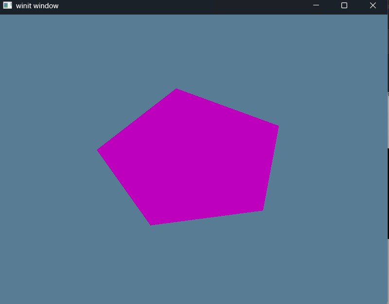
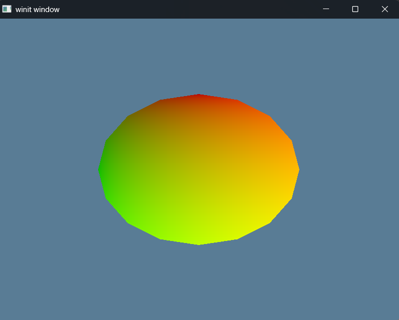

# Exercise 4 - Buffers and Indices - Challenge
## Objective
Create a more complex shape than the one we made (aka. more than three triangles) using a vertex buffer and an index buffer. Toggle between the two with the space key

# Solution
Tutorial Source Code - [Learn WGPU - Tutorial 4 Challenge](https://github.com/sotrh/learn-wgpu/blob/master/code/beginner/tutorial4-buffer/src/challenge.rs)


# Demo
Executing a ```cargo build | cargo run``` will run the application.

Pressing and releasing the space bar will trigger the render pipeline to swap between the shaders.

### Space Bar Released


### Space Bar Pressed
