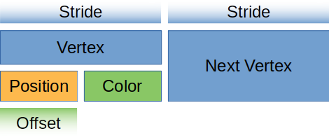
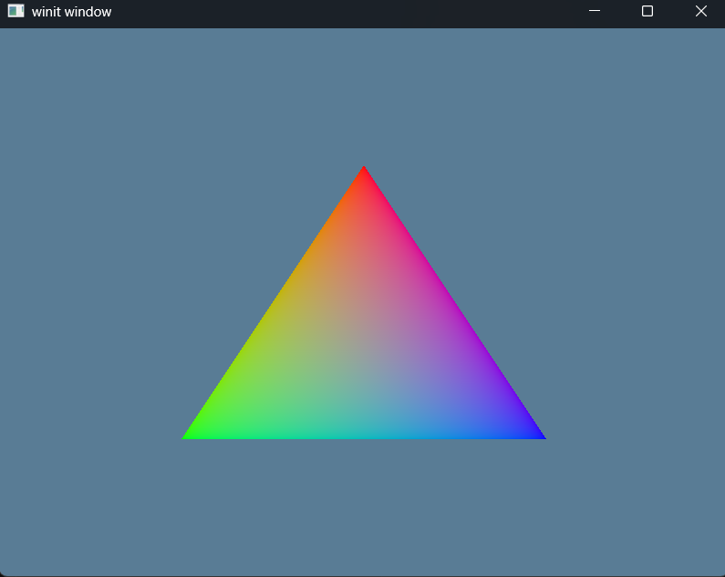

# Exercise 4a - Vertex Buffers
* Source Material - [Learn WGPU - Buffers and Indices](https://sotrh.github.io/learn-wgpu/beginner/tutorial4-buffer/#we-re-finally-talking-about-them)
## Objective
- Use vertex buffers instead of storing the Vertex data in the shader.wgsl.
## Concepts
- Vertex Buffer
- DeviceExt
- bytemuck
# Overview
## Vertex Buffers
- Buffer used to store Shader Vertex Data
    - We were previously storing vertex data in the ```shader.wgsl```, which is not an ideal long-term solution.
        - The types of objects we need to draw will vary in size, and recompiling the shader whenever we need to update the model would massively slow down our program
- To create the Vertex Buffer from the wgpu::Device in our State, we need the library wgpu::util::DeviceExt
    - [wgpu::util::DeviceExt](https://docs.rs/wgpu/latest/wgpu/util/trait.DeviceExt.html#tymethod.create_buffer_init)
- Here's a visual from [Learn WGPU - Buffers and Indices](https://sotrh.github.io/learn-wgpu/beginner/tutorial4-buffer/#we-re-finally-talking-about-them) showing the Vertex Buffer.

# Dependencies
```rust
[dependencies]
anyhow = "1.0"
winit = "0.30.12"
env_logger = "0.11.8"
log = "0.4"
wgpu = "26.0.1"
pollster = "0.4.0"
bytemuck = "1.23.1"
```
# Output
The output of this application after running ```cargo run``` should be the following multi-color triangle:
