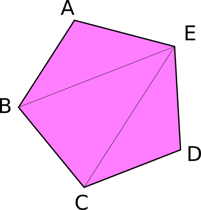
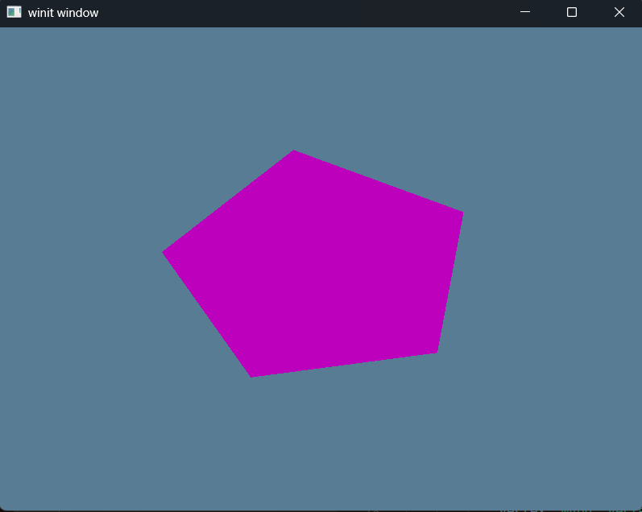

# Exercise 4b - Index Buffers
* Source Material - [Learn WGPU - Buffers and Indices](https://sotrh.github.io/learn-wgpu/beginner/tutorial4-buffer/#we-re-finally-talking-about-them)
## Objective
- Use index buffers to create a magenta pentagon.
## Concepts
- Index Buffer
# Overview
## Index Buffers
An index buffer comes into play when we start using models with a lot of triangles.
    
For Consider the above image for example that has a total of 5 vertices and 3 triangles. If we wanted to store this with the VERTICIES buffer that we learned, we'd need that array to look something like this:

    ```rust
    const VERTICES: &[Vertex] = &[
        Vertex { position: [-0.0868241, 0.49240386, 0.0], color: [0.5, 0.0, 0.5] }, // A
        Vertex { position: [-0.49513406, 0.06958647, 0.0], color: [0.5, 0.0, 0.5] }, // B
        Vertex { position: [0.44147372, 0.2347359, 0.0], color: [0.5, 0.0, 0.5] }, // E

        Vertex { position: [-0.49513406, 0.06958647, 0.0], color: [0.5, 0.0, 0.5] }, // B
        Vertex { position: [-0.21918549, -0.44939706, 0.0], color: [0.5, 0.0, 0.5] }, // C
        Vertex { position: [0.44147372, 0.2347359, 0.0], color: [0.5, 0.0, 0.5] }, // E

        Vertex { position: [-0.21918549, -0.44939706, 0.0], color: [0.5, 0.0, 0.5] }, // C
        Vertex { position: [0.35966998, -0.3473291, 0.0], color: [0.5, 0.0, 0.5] }, // D
        Vertex { position: [0.44147372, 0.2347359, 0.0], color: [0.5, 0.0, 0.5] }, // E
    ];
    ```
With this representation, C and B are used twice, and E is repeated three times. Assuming that each float is 4 bytes, then that means of the 216 bytes we use for VERTICES, 96 of them are duplicate data.

Index Buffers allow us to store indices of vertices that we uniquely set in the VERTICES.

Here's an the VERTICES converted to a unique array and the INDICES array for each vertex:

    ```rust
    const VERTICES: &[Vertex] = &[
        Vertex { position: [-0.0868241, 0.49240386, 0.0], color: [0.5, 0.0, 0.5] }, // A
        Vertex { position: [-0.49513406, 0.06958647, 0.0], color: [0.5, 0.0, 0.5] }, // B
        Vertex { position: [-0.21918549, -0.44939706, 0.0], color: [0.5, 0.0, 0.5] }, // C
        Vertex { position: [0.35966998, -0.3473291, 0.0], color: [0.5, 0.0, 0.5] }, // D
        Vertex { position: [0.44147372, 0.2347359, 0.0], color: [0.5, 0.0, 0.5] }, // E
    ];

    const INDICES: &[u16] = &[
        0, 1, 4,
        1, 2, 4,
        2, 3, 4,
    ]; 
    ```
As you can tell, this is going to require quite a bit less memory than the VERTICIES example. If you want a full explanation on the memory savings please checkout the Learn WGPU article that covers this more deeply.
  
# Dependencies
```rust
[dependencies]
anyhow = "1.0"
winit = "0.30.12"
env_logger = "0.11.8"
log = "0.4"
wgpu = "26.0.1"
pollster = "0.4.0"
bytemuck = "1.23.1"
```
# Output
The output of this application after running ```cargo run``` should be the following multi-color triangle:
