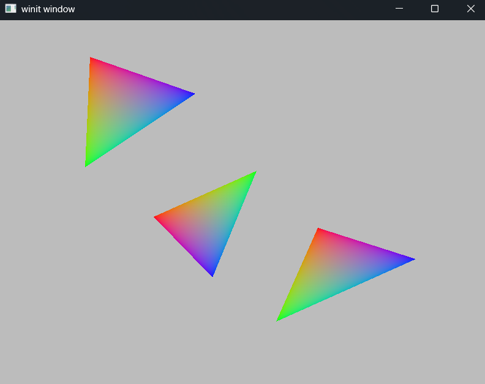

# Exercise 5 - Triangle List and Strip Primitives
## Dependencies
- wgpu
- winit
- env_logger
- bytemuck
- pollster
## Objective
The objective of this exercise is to explore WGPU TriangleList and TriangleStrip functionality, while providing the user the ability to modify the topology via the command line.
## Key Concepts
- WebGPU Point/Line Primitives
  1. Triangle-List  - Collection of triple-verticies representing triangles a location in space.
  3. Triangle-Strip - Connect triangles sequentially from a base triangle (creating the next triangle sequence by adding a vertex to the closest edge of the last generated triangle) to form a single, continuous polyline.
## Output
1. Triangle-List
- ```cargo run triangle-list```

  * NOTE: This image isn't super valuable because the points are the size of pixels. They may not be visible depending on the resolution.
2. Triangle-Strip
- ```cargo run triangle-strip```

## Code Notes
- Update ```renderpass.draw()``` method for the 6 verticies that are in the shader.wgsl
```rust
// src.state.rs - lina 142
// Update renderpass.draw() to include the 9 vertexes.
renderpass.draw(0..9, 0..1);
```

- New ```src/shader.wgsl```
```glsl
// src/shader.wgsl
struct VOutput{   
    @location(0) v_color: vec4<f32>,
    @builtin(position) position: vec4<f32>,
};

@vertex
fn vs_main(@builtin(vertex_index) in_vertex_index: u32) -> VOutput {    
    var pos : array<vec2<f32>, 9> = array<vec2<f32>, 9>(             
        vec2<f32>(-0.63,  0.80),
        vec2<f32>(-0.65,  0.20),
        vec2<f32>(-0.20,  0.60),
        vec2<f32>(-0.37, -0.07),
        vec2<f32>( 0.05,  0.18),
        vec2<f32>(-0.13, -0.40),
        vec2<f32>( 0.30, -0.13),
        vec2<f32>( 0.13, -0.64),
        vec2<f32>( 0.70, -0.30)     
    );
    
    var color : array<vec3<f32>, 9> = array<vec3<f32>, 9>(             
        vec3<f32>(1.0, 0.0, 0.0),   // RED
        vec3<f32>(0.0, 1.0, 0.0),   // GREEN
        vec3<f32>(0.0, 0.0, 1.0),   // BLUE
        vec3<f32>(1.0, 0.0, 0.0),   // RED
        vec3<f32>(0.0, 1.0, 0.0),   // GREEN
        vec3<f32>(0.0, 0.0, 1.0),   // BLUE
        vec3<f32>(1.0, 0.0, 0.0),   // RED
        vec3<f32>(0.0, 1.0, 0.0),   // GREEN
        vec3<f32>(0.0, 0.0, 1.0),   // BLUE
    );

    var out: VOutput;
    out.position = vec4<f32>(pos[in_vertex_index], 0.0, 1.0);
    out.v_color = vec4<f32>(color[in_vertex_index], 1.0);
    return out;
}

@fragment
fn fs_main(in: VOutput) -> @location(0) vec4<f32> {
    return in.v_color;
}
```